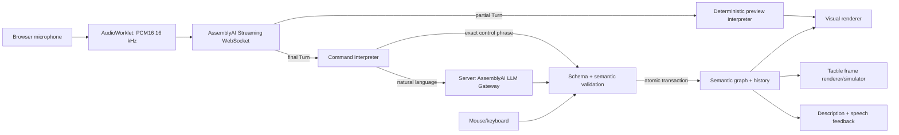

# Voice-to-Touch Flowchart Editor — Product and System Design

> **Document role:** This is the authoritative product/design specification and context handoff for the hackathon project. A new AI agent or engineer must read this entire document before proposing changes. It records settled decisions so implementation can begin without repeating discovery or asking product-clarification questions.
>
> **Status:** Approved conversational design, awaiting review of this written specification.
>
> **Working title:** TactiFlow. The name is provisional branding only; it does not affect implementation.
>
> **Last verified:** 2026-09-05 (Asia/Dubai).

## 1. Executive summary

Build a browser-based, real-time flowchart editor that lets a person create, edit, explore, and validate a flowchart by speaking. The same semantic graph is rendered simultaneously as:

1. an ordinary visual flowchart for sighted users;
2. a digital simulation of a refreshable tactile/Braille display for blind users; and
3. concise speech and Braille descriptions for navigation and confirmation.

AssemblyAI Universal-3.5 Pro Streaming converts speech to partial and final transcripts. Partial transcripts drive disposable visual previews so the interface reacts while the user is still speaking. Only a finalized and validated command may mutate the graph. The core design principle is:

> **Edit at the speed of speech; commit at the speed of certainty.**

The MVP demonstrates independent blind authorship first. A sighted person can also use mouse/keyboard on the same graph, proving the multimodal foundation, but real-time multi-user networking is explicitly deferred.

## 2. Hackathon context and deadline

- Event: [AssemblyAI Voice Agent Hackathon](https://lablab.ai/ai-hackathons/assemblyai-voice-agent-hackathon)
- Format: fully online, month-long challenge.
- Build window: **September 1–30, 2026**.
- Submission deadline date: **September 30, 2026**. The event page does not expose a reliable timezone-specific cutoff in its public text; the owner must verify the exact cutoff shown in the logged-in submission dashboard and submit at least 24 hours early.
- Prize pool: **$10,000 total** ($5,000 cash and $5,000 AssemblyAI credits).
- Required sponsor technology path: **AssemblyAI Real-time Speech-to-Text API**, not the Voice Agent API.
- Current project date: September 5, 2026, leaving 25 calendar days including the deadline date.

### Recommended internal deadlines

| Date | Required outcome |
|---|---|
| Sep 5 | Written design approved; implementation plan completed |
| Sep 6–8 | Project shell, graph domain, visual canvas, test harness |
| Sep 9–12 | Command validation/execution, undo/redo, exploration commands |
| Sep 13–16 | Browser microphone, AssemblyAI streaming, partial/final pipeline |
| Sep 17–19 | LLM Gateway structured command interpretation and ambiguity flow |
| Sep 20–22 | Tactile renderer, Braille information strip, large-chart viewport |
| Sep 23–24 | Accessibility pass, keyboard/mouse parity, spoken feedback |
| Sep 25–26 | Integration, latency measurement, failure-path and browser testing |
| Sep 27 | Demo script frozen and first complete recording |
| Sep 28 | Submission copy, screenshots, architecture diagram, backup recording |
| Sep 29 | Final regression run and submission buffer; submit if portal allows |
| Sep 30 | Emergency buffer only; no planned feature work |

## 3. Problem and opportunity

Flowchart tools are predominantly visual and spatial. Voice input alone does not make them accessible: a blind author also needs a nonvisual way to inspect the structure they created, understand branches and connections, locate focus, and verify that an edit had the intended effect.

Conversely, a tactile-only tool can isolate blind collaborators from the visual workflows used by sighted teammates. The opportunity is not merely “voice creates a picture.” It is a shared semantic artifact rendered appropriately for different senses.

### Primary problem statement

A blind user needs to author and understand a flowchart independently, with immediate feedback, without relying on a sighted person to inspect the resulting diagram.

### Secondary problem statement

Blind and sighted people need representations of the same flowchart that remain semantically synchronized instead of maintaining separate accessible and visual copies.

## 4. Product positioning and novelty boundaries

Do not claim that voice diagrams, tactile diagrams, refreshable tactile displays, or accessible diagram editors are individually new. Related work and products include:

- [AccessFlow](https://www.access-flows.com/): accessible exploration of flowcharts through structured text, keyboard/touch, and tactile-paper workflows.
- [Cross-modal collaborative diagram editing research](https://repository.gatech.edu/entities/publication/3f5b35bb-7dff-4470-830b-b0428795d8f4): prior research on shared diagram access for blind and sighted collaborators.
- [APH Monarch](https://www.aph.org/product/monarch/): multiline Braille and tactile graphics hardware with a visual mirror.
- [Graphiti Plus](https://www.orbitresearch.com/products/blindness-products/tactile-graphic-displays/graphiti-plus-interactive-tactile-graphics-and-braille-computer/): refreshable tactile graphics/Braille hardware.
- [Umwelt](https://flow-and-interaction.org/media/videos/umwelt-conference-talk/): accessible multimodal data authoring research.
- [AssemblyAI browser streaming example](https://github.com/AssemblyAI/realtime-transcription-browser-js-example): microphone-to-streaming-transcript reference, not a diagram editor.

The defensible project claim is:

> TactiFlow explores a real-time, voice-first flowchart editor in which one semantic graph drives synchronized visual, simulated tactile, Braille, and spoken representations, enabling independent blind authorship and laying the foundation for blind/sighted collaboration.

Avoid “world’s first,” “never built before,” or equivalent claims unless a later documented prior-art review supports them.

## 5. Users and use cases

### Primary user

A blind or severely visually impaired student, analyst, developer, or product professional who prefers speech for authoring and tactile/Braille plus audio for structural inspection.

### Secondary user

A sighted teammate who edits the same flowchart using the visual canvas, mouse, or keyboard and needs their changes reflected in the accessible representations.

### Core demo use case

The user creates a payment-validation flowchart from an empty canvas, adds a decision and two outcomes, inspects the resulting structure through focus and path descriptions, corrects a mistake with undo, and observes every committed change in the visual and tactile simulators.

## 6. Goals, non-goals, and product principles

### MVP goals

- Create a flowchart from an empty state using natural spoken commands.
- Show low-latency partial transcription and a clearly noncommitted visual preview.
- Commit only final, schema-valid, semantically valid commands.
- Support adding, connecting, renaming, moving, deleting, undoing, and redoing.
- Support describing the chart, inspecting a node, tracing a path, focusing a node, and validating structure.
- Render one semantic graph as synchronized visual and tactile views.
- Make large diagrams usable through overview and focus-neighborhood modes.
- Allow basic mouse/keyboard editing against the same command engine.
- Meet practical browser accessibility requirements: keyboard operation, visible focus, screen-reader labels, live status, reduced motion, and non-color-only state cues.
- Produce a polished, reliable hackathon demonstration centered on AssemblyAI streaming.

### Explicit non-goals for the MVP

- Physical refreshable tactile hardware integration.
- Claiming that the digital simulator proves hardware ergonomics or Braille-user usability.
- Offline speech recognition or offline voice commands.
- Simultaneous multi-user networking, accounts, permissions, or cloud persistence.
- General-purpose diagrams beyond flowcharts.
- Freeform pixel positioning, colors, fonts, themes, image nodes, or arbitrary shapes.
- Full Braille translation software or certification. The simulator may display Unicode Braille/labels as a representational demo and must say so.
- Mobile and Safari optimization. Desktop Chromium is the required demo target.
- Medical, legal, or safety-critical flowchart guarantees.

### Product principles

1. **One graph, many representations.** No renderer owns business state.
2. **Preview is disposable.** Partial transcripts never mutate committed state.
3. **Never guess a destructive reference.** Ambiguity causes clarification.
4. **Semantic placement over pixels.** Users say “after,” “before,” or “beside,” while automatic layout chooses coordinates.
5. **Accessibility is a product surface, not a generated caption.** Blind users can create and inspect.
6. **All edit paths converge.** Voice, keyboard, and mouse emit the same validated graph commands.

## 7. Functional requirements

### 7.1 Editing operations

The canonical command vocabulary is:

| Operation | Required fields | Example utterance |
|---|---|---|
| `add_node` | `type`, `label`, optional placement | “Add a decision called Payment approved after Validate card.” |
| `connect` | `source`, `target`, optional edge label | “Connect Payment approved to Show receipt with label yes.” |
| `rename` | node reference, new label | “Rename Validate card to Validate payment card.” |
| `move` | node reference, relation, reference node | “Move Show error below Payment rejected.” |
| `delete` | node or edge reference | “Delete Show error.” |
| `focus` | node reference | “Focus Payment approved.” |
| `undo` | none | “Undo.” |
| `redo` | none | “Redo.” |

Supported node types are exactly `start`, `process`, `decision`, and `end` for the MVP.

Supported semantic placement relations are exactly `before`, `after`, `above`, `below`, `left_of`, and `right_of`. Placement expresses layout intent only; graph connectivity is changed only by `connect` or an explicit compound command.

### 7.2 Exploration operations

| Operation | Behavior | Example utterance |
|---|---|---|
| `describe` | Summarize whole chart or selected scope | “Describe the chart.” |
| `inspect` | State focused node type, label, incoming/outgoing edges | “Inspect this node.” |
| `trace_path` | Read an ordered route from a start node, optionally to a target | “Trace from Start to Show receipt.” |
| `validate` | Report unreachable nodes, missing decision branches, unlabeled decision edges, and absence of start/end nodes | “Validate the chart.” |

Exploration commands never change graph history.

### 7.3 Reference resolution

Resolve a spoken node reference in this order:

1. case-insensitive exact label;
2. the currently focused node for pronouns such as “this” or “it”;
3. a unique normalized/fuzzy label match above the implementation’s documented threshold;
4. the uniquely most recently changed node only for explicit phrases such as “the node I just added.”

If multiple candidates remain, return a clarification request listing at most three labels. Do not execute. The next final user turn is interpreted in the stored clarification context. Similar labels must never be selected silently.

### 7.4 Deletion

- Deleting an unconnected node or a uniquely identified edge executes immediately.
- Deleting a node with any incident edge creates a confirmation state that states the number of connections to be removed.
- “Confirm” executes the pending deletion; “cancel” discards it.
- All deletions are undoable.

### 7.5 Undo and redo

- Each successful edit is one atomic history entry, including a compound command.
- A new edit after undo clears the redo stack.
- Focus changes and exploration do not create history entries.
- Undo/redo update all renderers from the restored graph snapshot.

## 8. Interaction and feedback design

### 8.1 Session flow

1. The app opens with an empty graph and both renderers visible.
2. The user activates **Start listening** once and grants microphone access.
3. The status changes from `idle` to `connecting`, then `listening` after AssemblyAI confirms the session.
4. Each partial turn replaces the previous partial transcript for that turn.
5. A deterministic preview interpreter may create a visual-only speculative preview when the utterance is sufficiently recognizable.
6. A final turn (`end_of_turn: true`) clears the speculative preview and enters `interpreting`.
7. The command is interpreted, schema-validated, reference-resolved, and semantically validated.
8. On success, one atomic graph transaction commits, both renderers update, focus moves to the primary affected node, and a concise confirmation is announced.
9. On ambiguity or validation failure, the graph remains unchanged and the app enters `needs_clarification` or `error` with actionable wording.
10. **Stop listening** sends a proper termination/close request so the session is not billed unnecessarily.

### 8.2 Visible and announced states

The state machine contains: `idle`, `connecting`, `listening`, `speech_detected`, `previewing`, `interpreting`, `committed`, `needs_clarification`, `confirming_delete`, `error`, and `voice_unavailable`.

Every state has:

- visible text, not color alone;
- an ARIA live announcement where appropriate;
- a stable icon or shape treatment;
- a tactile simulator treatment only if it represents committed graph state.

Use these exact semantic labels in user-facing status copy:

- “Listening”
- “Preview—not yet applied”
- “Applying command”
- “Change applied”
- “Clarification needed”
- “Voice editing unavailable—connection lost”

The phrase “voice editing is offline” is forbidden because it incorrectly implies offline voice capability.

### 8.3 Speech feedback

- Successful edit: one short result, e.g. “Added decision Payment approved after Validate card.”
- Exploration result: enough structure to answer the request, with an optional “continue” action for long output.
- Error: reason plus one recovery hint, not a generic failure.
- Clarification: one question with candidate labels.
- Spoken output must not be interpreted as a user command. Prefer browser acoustic echo cancellation and treat AssemblyAI `SpeechStarted` as barge-in. If loopback remains during testing, suppress microphone frames only while the app speaks and expose this behavior in status text.
- Speech feedback is user-toggleable but enabled by default for the blind-author demo.

## 9. Semantic graph: the single source of truth

Renderers must be pure consumers of a serializable domain state. A representative TypeScript contract is:

```ts
type NodeId = string;
type EdgeId = string;
type NodeType = "start" | "process" | "decision" | "end";

interface FlowNode {
  id: NodeId;
  type: NodeType;
  label: string;
  placement?: {
    relation: "before" | "after" | "above" | "below" | "left_of" | "right_of";
    referenceNodeId: NodeId;
  };
}

interface FlowEdge {
  id: EdgeId;
  source: NodeId;
  target: NodeId;
  label?: string;
}

interface FlowGraph {
  schemaVersion: 1;
  nodes: FlowNode[];
  edges: FlowEdge[];
}

interface EditorState {
  graph: FlowGraph;
  focusedNodeId: NodeId | null;
  tactileMode: "overview" | "focus";
  pendingPreview: GraphCommand | null;
  pendingInteraction: PendingClarification | PendingDeletion | null;
}
```

IDs are stable, opaque, generated locally, and never derived from labels. Labels need not be globally unique, but duplicate labels intentionally force clarification when referenced by name. Edges cannot point to missing nodes. Self-edges are rejected in the MVP; cycles involving multiple nodes are valid because flowcharts may loop.

## 10. Command interpretation and transaction pipeline

### 10.1 Structured command envelope

All input methods emit a discriminated union equivalent to:

```ts
type GraphCommand =
  | { kind: "add_node"; type: NodeType; label: string; placement?: PlacementRef }
  | { kind: "connect"; source: SpokenRef; target: SpokenRef; label?: string }
  | { kind: "rename"; node: SpokenRef; newLabel: string }
  | { kind: "move"; node: SpokenRef; placement: PlacementRef }
  | { kind: "delete"; target: SpokenElementRef }
  | { kind: "focus"; node: SpokenRef }
  | { kind: "undo" }
  | { kind: "redo" }
  | { kind: "describe"; scope: "chart" | "focus" }
  | { kind: "inspect"; node?: SpokenRef }
  | { kind: "trace_path"; start: SpokenRef; end?: SpokenRef }
  | { kind: "validate" }
  | { kind: "confirm" }
  | { kind: "cancel" };
```

The implementation plan must define every referenced sub-type and the exact JSON Schema. LLM output is untrusted even when structured-output mode is enabled and must be validated again locally.

### 10.2 Partial transcript path

- AssemblyAI emits the full current turn repeatedly; replace the displayed partial rather than appending it.
- Run only a deterministic, side-effect-free preview interpreter.
- A preview may render on the visual canvas in amber/dashed styling and must display “Preview—not yet applied.”
- Never update the semantic graph, undo history, Braille strip, spoken committed description, or physical-device adapter from a partial.
- When a later partial revises the utterance, replace the previous preview completely.

### 10.3 Final transcript path

- `end_of_turn: true` is the authority for committing a spoken turn.
- Exact control utterances (`undo`, `redo`, `confirm`, `cancel`, and exact focus/describe forms) may use a deterministic fast path.
- Other finalized utterances go server-side to AssemblyAI LLM Gateway using strict structured outputs and JSON repair.
- Include the current graph summary, current focus, pending interaction, and allowed command schema in the prompt. Do not send visual coordinates.
- Validate response JSON with the same local runtime schema used for all command sources.
- Resolve references against the current graph.
- Validate graph invariants and command preconditions.
- Apply the command to a cloned state and validate the result.
- Commit the complete result atomically or keep the prior state unchanged.

### 10.4 AssemblyAI configuration baseline

- Speech model: `universal-3-5-pro`.
- Audio: mono PCM signed 16-bit little-endian at 16 kHz, created in an `AudioWorklet` from browser microphone input.
- Turn mode: begin with `balanced`; measure actual command latency before changing thresholds.
- Partials: enabled. Use early partials for preview only.
- Prompting: begin with no contextual prompt as AssemblyAI recommends. Add a short domain prompt or `keyterms_prompt` only after recorded transcription errors demonstrate the need. Candidate keyterms include “flowchart,” “node,” “decision,” “connect,” and labels in the current graph.
- Conversation context: prior finalized user turns are carried automatically. Use `agent_context` after spoken clarifications when it materially helps recognition of a short reply.
- Browser authentication: fetch a one-time temporary streaming token from the app server. Never expose `ASSEMBLYAI_API_KEY` in browser code.
- Temporary token lifetime: 60 seconds to initiate; maximum session duration: 30 minutes for the demo. Fetch a fresh token for every connection/reconnection.
- Stop/cleanup: close/terminate sessions explicitly. Streaming is billed for WebSocket session duration, not only audio duration.

### 10.5 LLM Gateway baseline

- Endpoint: `https://llm-gateway.assemblyai.com/v1/chat/completions` from server code only.
- Default model: `gemini-2.5-flash-lite`, configurable through `ASSEMBLYAI_LLM_MODEL` without code changes.
- Response format: strict JSON Schema with `additionalProperties: false` at every object level.
- Post-processing: `[{ "type": "json-repair" }]`.
- Runtime validation remains mandatory after JSON parsing.
- Set a short output limit because only one command envelope is expected.
- If the configured model is unavailable, fail with a clear server error and log the current model name; do not silently change providers during a judged demo. A fallback may be configured deliberately after checking the official available-model list.

## 11. Rendering design

### 11.1 Visual renderer

- Conventional flowchart shapes: rounded start/end, rectangle process, diamond decision.
- Directed edges with visible arrowheads and optional labels.
- Automatic deterministic layout; semantic placement acts as a layout hint.
- Committed focus uses a strong blue outline plus a focus badge/text.
- Speculative preview uses amber, dashed treatment, reduced opacity, and explicit preview text.
- Errors and clarifications appear in a persistent command/status panel rather than transient toast only.
- Mouse and keyboard actions dispatch canonical graph commands instead of mutating visual-library state directly.

### 11.2 Digital tactile-display simulator

The simulator represents a generic refreshable tactile graphics display and must not falsely claim conformance to a particular device SDK.

It contains two regions:

1. **Tactile graphics matrix:** a grid of simulated pins. Lowered pins are light/empty dots; raised pins are dark dots. Node outlines, connecting paths, and arrowheads are rasterized onto this matrix.
2. **Braille information strip:** the focused node’s short ID, type, and full label, with a plain-text translation visible to judges.

Tactile mapping:

| Meaning | Tactile representation |
|---|---|
| Start/end | Rounded outline |
| Process | Rectangular outline |
| Decision | Diamond outline |
| Edge | Raised line |
| Direction | Distinct tactile arrowhead at target |
| Focus | Filled center marker or double border, not color alone |
| Node identity | Short stable display ID such as `S1`, `P1`, `D1`, `E1` |

Full labels are not squeezed into the graphics matrix. They appear in the Braille information strip and speech output. Color in the simulator is judge-facing metadata only: blue may indicate focus and amber may indicate a visual preview, but tactile semantics must remain understandable without color.

The tactile renderer consumes committed graph state only. The simulator may show an amber preview overlay outside the pin matrix if it is explicitly labeled **not sent to a physical display**.

### 11.3 Large-chart behavior

- `overview` mode shows the simplified overall topology and short IDs.
- `focus` mode shows the focused node, its immediate predecessors, its immediate successors, and edges among those nodes.
- Focus mode is the default once the graph no longer fits legibly in the tactile matrix.
- Voice focus/navigation changes the viewport, not the underlying graph.
- Speech preserves off-screen context, e.g. “Payment approved, decision D1; one incoming edge from Validate card; yes goes to Show receipt; no goes to Show error.”
- The visual canvas may show the complete graph while the tactile matrix shows a focused neighborhood; both highlight the same focused node.

### 11.4 Future hardware adapter boundary

Define a renderer-neutral adapter contract such as `render(frame: TactileFrame): Promise<void>`, where `TactileFrame` contains matrix dimensions, raised-pin coordinates, Braille cells/text, focus metadata, and frame version. The simulator implements this contract first. A future Dot Pad, Graphiti, Monarch, or other hardware adapter can translate the same frame to its SDK without changing graph or command logic.

## 12. Technical architecture



### Trust boundaries

- Browser: microphone capture, streaming WebSocket authenticated with a temporary token, stateful editor, renderers, and accessible UI.
- App server: holds AssemblyAI API key, mints temporary tokens, calls LLM Gateway, rate-limits requests, and redacts server errors.
- AssemblyAI: transcription and optional language interpretation.
- No database is required. The MVP may serialize the graph to browser local storage and JSON import/export only if time remains after the critical path.

### Server endpoints

The implementation plan should preserve these responsibilities even if framework routing changes exact filenames:

- `POST /api/assemblyai/token`: server-only API-key use; returns one temporary streaming token and expiry metadata; no caching.
- `POST /api/commands/interpret`: accepts final transcript plus bounded graph context; calls LLM Gateway; returns a locally validated `GraphCommand` or a typed error.
- Optional `GET /api/health`: confirms app process health without exposing credentials.

## 13. Tech stack decision

Because the workspace is empty, use a single TypeScript web application rather than a multi-language or microservice architecture.

| Area | Choice | Reason |
|---|---|---|
| App framework | Next.js with App Router, latest stable at bootstrap and pinned in lockfile | One deployable project with browser UI and server-only API routes |
| Language | TypeScript with `strict: true` | Shared types across graph, renderer, and API boundaries |
| Runtime | Node.js 20 or newer | Above AssemblyAI’s documented Node 18 minimum and broadly deployable |
| Package manager | npm | Lowest setup friction for judges/agents; commit `package-lock.json` |
| Visual graph | `@xyflow/react` | Interactive visual node/edge canvas |
| Automatic layout | `@dagrejs/dagre` | Deterministic directed-graph layout adequate for MVP flowcharts |
| Runtime schemas | Zod plus generated/manual JSON Schema kept contract-tested | Validates commands at every trust boundary |
| AssemblyAI | Official `assemblyai` JavaScript SDK where its browser/server surfaces fit; raw documented WebSocket only where audio streaming requires it | Current supported API types and temporary-token support |
| Audio | Web Audio API + `AudioWorklet` | Required browser PCM capture without deprecated `ScriptProcessorNode` |
| State | React reducer/context with pure domain functions | Avoid unnecessary state-library dependency; deterministic tests/history |
| Unit/integration tests | Vitest + Testing Library | Fast TypeScript tests and component behavior |
| End-to-end tests | Playwright with mocked AssemblyAI boundaries | Reproducible browser flows without spending API credit |
| Accessibility tests | `axe-core`/Playwright plus keyboard and screen-reader manual checklist | Automated baseline plus essential human verification |
| Styling | CSS Modules or a small global token sheet | Custom accessible visuals without adopting a large design system |
| Deployment | Vercel or another HTTPS Node host | Microphone requires localhost or HTTPS; server routes keep secrets private |

Do not lock version numbers in this design document based on memory. Bootstrap with the current stable packages, commit the exact resolved versions and lockfile, and record them in the implementation README. Do not upgrade dependencies during the final submission week without a specific defect requiring it.

## 14. Planned project structure

```text
/
├─ README.md                         # project pitch, setup, commands, demo and doc index
├─ .env.example                      # names only; no secrets
├─ docs/
│  ├─ superpowers/specs/             # this authoritative design
│  ├─ superpowers/plans/             # execution plan after written-spec approval
│  ├─ demo-script.md                 # exact judged demo narration and recovery path
│  └─ accessibility-test-log.md      # manual checks and known limitations
├─ public/
│  └─ audio/pcm16-worklet.js         # mic resampling and Float32-to-PCM16 conversion
├─ src/
│  ├─ app/                           # page, layout, server routes
│  ├─ editor/                        # editor composition and interaction state machine
│  ├─ graph/                         # graph types, invariants, transactions, history, queries
│  ├─ commands/                      # schemas, preview parser, resolver, executor
│  ├─ streaming/                     # AssemblyAI session and microphone adapters
│  ├─ visual/                        # XYFlow adapter and automatic layout
│  ├─ tactile/                       # frame model, rasterizer, simulator, viewport logic
│  ├─ feedback/                      # descriptions, ARIA live output, optional browser speech
│  └─ test/                          # shared fixtures/mocks
└─ e2e/                              # Playwright scenarios
```

Each file introduced by the implementation plan must have one primary responsibility. Graph-domain code must be framework-independent and unit-testable without rendering a browser.

## 15. Error handling and recovery

| Failure | Required behavior |
|---|---|
| Microphone denied | Stay idle; explain how to grant permission; keyboard/mouse remain usable |
| Token creation fails | Show voice unavailable; preserve graph; never expose upstream response body or API key |
| WebSocket disconnects | Preserve last committed graph/tactile frame; show “Voice editing unavailable—connection lost”; allow a fresh one-time-token reconnect |
| Partial transcript changes | Replace transcript and preview; no graph rollback is needed because nothing committed |
| LLM timeout or HTTP failure | No graph change; actionable retry message; log a correlation ID server-side |
| Invalid/malformed command JSON | Reject locally; no graph change; state that the command could not be understood |
| Missing reference | No graph change; name the missing label and suggest `describe` or `focus` |
| Ambiguous reference | Store clarification state; ask one concise question; do not guess |
| Connected-node deletion | Store confirmation state; state connection count; wait for confirm/cancel |
| Renderer exception | Retain graph; show degraded renderer status; never mutate domain state to match failed rendering |
| App speech loops into microphone | Use echo cancellation/barge-in first; if reproduced, gate outgoing mic frames during spoken confirmation |

The application does **not** provide offline voice editing. Only the existing chart and nonvoice editing remain available during network loss.

## 16. Security, privacy, and cost controls

- `ASSEMBLYAI_API_KEY` exists only in server environment variables.
- Browser streaming uses a one-time temporary token with bounded session duration.
- LLM Gateway requests are made only by the server route.
- Do not log raw API keys, temporary tokens, microphone audio, or full transcripts in production logs.
- The UI must visibly indicate when the microphone is active.
- Stop the WebSocket and every microphone track on stop, navigation/unmount, and unrecoverable error.
- Never commit `.env.local` or secrets; provide `.env.example` with variable names and explanations.
- Rate-limit token and interpretation endpoints sufficiently for a public demo.
- Bound graph context sent to the LLM by node/edge count and serialized character length.
- Streaming billing is based on open-session duration; avoid idle forgotten sessions and provide an automatic 30-minute session maximum for the demo.

## 17. Accessibility requirements

- All functionality required by the demo is keyboard reachable.
- Use native buttons and form elements where possible.
- Provide a skip link and meaningful landmarks/headings.
- Maintain logical focus; after a committed voice edit, do not steal DOM focus from a keyboard user.
- Expose the focused node and graph summary as structured text outside the canvas.
- Use polite ARIA live announcements for partial/status updates and assertive output only for blocking errors.
- Do not announce every partial transcript through a screen reader; expose it visually and update an accessible transcript region at a controlled rate.
- Every color-coded state has text, shape, pattern, or icon redundancy.
- Minimum target size and contrast meet WCAG 2.2 AA intent.
- Honor `prefers-reduced-motion`.
- Test at minimum with keyboard-only operation and one desktop screen reader available on Windows (NVDA preferred).
- Clearly label the tactile display as a simulator and Braille as a digital demonstration, not validated hardware output.

## 18. Testing strategy and acceptance criteria

### Domain unit tests

- Every command kind succeeds on valid input and fails without mutation on invalid input.
- Add/connect/rename/move/delete preserve unique IDs and edge integrity.
- Connected-node deletion requires confirmation.
- Undo/redo restores exact graph snapshots and renderer inputs.
- Multi-node cycles are accepted; self-edges are rejected.
- Reference resolution covers exact, focused, fuzzy-unique, missing, and ambiguous cases.
- Graph validation reports unreachable nodes, missing start/end, and incomplete decision labeling.
- Overview/focus viewport selection is deterministic.
- Tactile rasterization never writes outside frame bounds.

### Streaming contract tests

- Each partial supersedes the prior partial for the same turn.
- Partials can replace/clear previews but cannot dispatch a graph transaction.
- Only `end_of_turn: true` enters final interpretation.
- Disconnect closes audio resources and preserves committed state.
- Reconnect requests a new temporary token.

### API contract tests

- Token route requires server key and returns no key material.
- Interpretation route rejects oversized/invalid input.
- Gateway structured output is parsed and then Zod-validated.
- Gateway error, timeout, malformed JSON, and schema mismatch all produce typed nonmutating errors.

### Component/end-to-end tests

- Empty chart can be built through a mocked stream of partial/final turns.
- Amber preview appears before final and disappears on commit or revision.
- Visual and tactile views show the same node/edge/focus version after every transaction.
- Ambiguous command asks for clarification and later resolution commits once.
- Undo initiated by voice restores both views.
- One mouse/keyboard edit updates the tactile simulator.
- Large graph switches to focused-neighborhood behavior.
- Network loss shows the exact unavailable wording and retains manual editing.
- Axe finds no serious or critical violations on the primary page states.

### Live integration checks

Run a small, explicit set against a real AssemblyAI account:

1. Start/stop creates and terminates one streaming session.
2. Speak each core command type in a quiet environment.
3. Test one natural pause inside a long command.
4. Test one intentionally ambiguous label.
5. Confirm the API key never appears in browser source, storage, or network responses.
6. Measure median and worst observed time from speech start to first preview and from final turn to committed update.

### MVP acceptance criteria

The project is demo-ready only when all are true:

- A blindfolded keyboard/speech operator can create and inspect the scripted chart without relying on the visual canvas.
- A sighted observer sees each committed graph update and the corresponding tactile simulation update together.
- No partial transcript can mutate committed state in tests or live use.
- All destructive ambiguity paths preserve the graph.
- The complete core demo succeeds three consecutive times on the target machine/network.
- Unit/integration/E2E suites pass from a clean install.
- The README contains exact setup, environment, run, test, and demo instructions.
- Submission assets are prepared by September 28.

## 19. Demo script and judging story

Target a 2–3 minute primary demo with a prerecorded backup.

1. **Problem (15 sec):** Existing flowcharts are visual; voice creation alone is insufficient if a blind author cannot inspect the result.
2. **Shared model (10 sec):** Show visual canvas beside tactile simulator and explain one semantic graph drives both.
3. **Live responsiveness (25 sec):** Say “Add a start called Begin.” Show partial transcript and amber preview before the finalized command commits.
4. **Build structure (35 sec):** Add “Validate card,” add decision “Payment approved,” connect nodes, and create “Show receipt”/“Show error” outcomes.
5. **Nonvisual inspection (25 sec):** Focus the decision, show Braille strip/plain translation, and say “Inspect this node” then “Trace from Begin to Show receipt.”
6. **Safety (20 sec):** Create two similarly named nodes or issue an ambiguous reference; show that the app asks rather than guessing. Demonstrate undo.
7. **Multimodal parity (15 sec):** Make one keyboard/mouse edit; tactile view updates from the same graph.
8. **Scale (15 sec):** Load a prepared larger graph and switch tactile simulator from overview to focus neighborhood.
9. **Close (10 sec):** Independent blind authorship today; device adapters and live blind/sighted collaboration next.

Maintain a prepared JSON fixture for the large graph and a prerecorded video in case venue audio, browser permissions, or network connectivity fails. The backup does not replace the live AssemblyAI integration in the submitted project.

## 20. Risks and mitigations

| Risk | Impact | Mitigation |
|---|---|---|
| Partial transcripts revise earlier words | Preview flicker or wrong intent | Replace, never append; previews are disposable |
| Final command interpretation feels slow | Weak “instant” claim | Deterministic preview; exact-control fast path; small schema/context; measure rather than claim unsupported latency |
| LLM invents labels/operations | Graph corruption | Strict schema, local resolution, invariant validation, atomic transaction |
| Tactile simulator appears cosmetic | Accessibility story loses credibility | Semantic shapes, focus neighborhood, Braille strip, speech exploration, explicit simulator limitations |
| Large charts become unreadable | Demo fails on scale | Overview/focus modes and automatic layout |
| TTS feeds microphone | False command | Echo cancellation, SpeechStarted/barge-in, tested mic gating fallback |
| API key leakage | Security/cost incident | Server-only key and one-time temporary tokens |
| Streaming cost from forgotten sessions | Credit waste | Explicit close, track cleanup, 30-minute cap, visible mic state |
| Hackathon deadline/timezone ambiguity | Late submission | Verify dashboard cutoff; submit by Sep 29 |
| Overbuilding collaboration/hardware | Core demo incomplete | Preserve non-goals and adapter boundary; no physical SDK work in MVP |

## 21. Required credentials and external access

The implementation agent may proceed without clarification until live integration. The project owner must provide only:

- an AssemblyAI account/API key with Streaming STT and LLM Gateway access, stored locally as `ASSEMBLYAI_API_KEY`;
- access to the lablab.ai submission dashboard before the submission rehearsal;
- deployment-provider access if a public hosted demo is required.

Do not ask the owner for a tactile-device SDK for the MVP because the approved scope uses a generic digital simulator. Ask for a specific SDK only after the MVP passes and the owner explicitly expands scope to physical hardware.

## 22. Authoritative documentation links

Agents must verify API code against current official documentation rather than memory:

- [AssemblyAI Streaming quickstart](https://www.assemblyai.com/docs/streaming/getting-started/transcribe-streaming-audio)
- [Streaming turn detection](https://www.assemblyai.com/docs/streaming/turn-detection)
- [Streaming prompting and keyterms](https://www.assemblyai.com/docs/streaming/prompting-and-keyterms)
- [Conversation context](https://www.assemblyai.com/docs/streaming/universal-3-5-pro/context-carryover)
- [Temporary browser tokens](https://www.assemblyai.com/docs/streaming/authenticate-with-a-temporary-token)
- [LLM Gateway quickstart](https://www.assemblyai.com/docs/llm-gateway/quickstart)
- [LLM Gateway structured outputs](https://www.assemblyai.com/docs/llm-gateway/structured-outputs)
- [Official AssemblyAI JavaScript SDK](https://github.com/AssemblyAI/assemblyai-node-sdk)
- [Official browser streaming example](https://github.com/AssemblyAI/realtime-transcription-browser-js-example)
- [MDN AudioWorklet](https://developer.mozilla.org/en-US/docs/Web/API/AudioWorklet)
- [Web Content Accessibility Guidelines 2.2](https://www.w3.org/TR/WCAG22/)

## 23. Instructions for the next AI agent

1. Read this specification completely.
2. Treat all scope, architecture, terminology, and UX decisions here as settled unless implementation evidence proves a contradiction.
3. Do not ask the owner to reselect framework, graph model, command set, tactile behavior, or MVP scope.
4. Before coding, read the implementation plan in `docs/superpowers/plans/` and follow it task-by-task.
5. Use current official AssemblyAI documentation for SDK signatures and endpoints; do not guess.
6. Keep all API keys server-side and all graph mutations behind schema/semantic validation.
7. Preserve the partial-preview/final-commit invariant above every optimization.
8. Use test-driven development for domain and command logic and keep commits small.
9. Do not add physical hardware, multi-user networking, user accounts, databases, or extra diagram types unless the owner explicitly changes scope.
10. If a non-product implementation detail is unavailable, choose the smallest reversible option consistent with this document, record it in the README, and continue instead of asking a product clarification.

## 24. Definition of design completion

This design is complete when the owner confirms that this written document accurately reflects the approved conversation. After that confirmation, create the detailed task-by-task implementation plan at:

`docs/superpowers/plans/2026-09-05-voice-tactile-flowchart.md`

That plan must name exact files, interfaces, tests, commands, expected failures/passes, and commit boundaries. It must reference this specification and must not contain placeholders.
